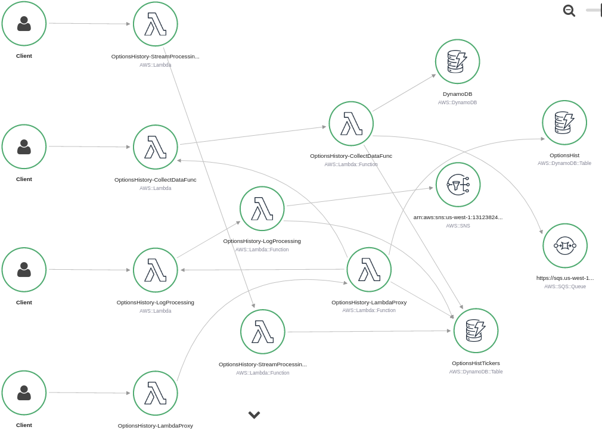

# AWS Historical Options Data  

Turn Key AWS CloudFormation stack for putting up a simple options pricing data scraping application (scrapes data and stores for later retrieval). I built everything in here to take advantage of AWS perpetual free tier. This project is really just an excuse to play around with AWS server-less services and CloudFormation. It does work alright but see [caveats](#Caveats)

### Installation/Deploy Stack/Getting Started   

> 1. AWS CLI installed and configured, on a system that can run bash scripts. [aws-cli installation and configuration help](https://docs.aws.amazon.com/cli/latest/userguide/install-cliv2.html)
>> All the lambda function have already been built and packaged in the lamci/lambda:build-Python3.7 docker container. No need to rebuild to package unless you make changes.   

> 2. Open ./deploy-stack.sh and set REQUIRED and OPTIONAL Stack Configuration Variables. 
>> See [Stack Configuration Options](#StackOptions)   

> 3. Deploy the Stack to AWS. The script pushes the code artifacts to S3, deploys the stack, and dumps the API url to a local file APIEndpoint for use in optional commands below.
>> ``` bash deploy-stack.sh ```   

> 4. Optional: add-dow-tickers.sh. Requires curl is installed and reachable in the bash shell path. Will add the 30 companies in the DOW index to the collection list. See [Configuration](#CronSchedule) below for when and how often the data gets collected.
>> ``` bash add-dow-tickers.sh ```   

> 5. Optional: Manually start a collection run i.e. go collect data for all companies in the collection list. See [API Resources](#Endpoints)
>> ``` bash curl -X POST $(cat APIEndpoint)/collect ```   

> 6. Optional: clientexample/clientexample.py is an example script for how to get the data out of AWS once it has been collected. You can get the data out as a JSON object that can be directly read into a pandas data frame, or in an encoded format that is decoded on the client side to reduce network traffic. clientexample/requirements.txt defines a minimal python environment that will run the example.
>> ``` python clientexample/clientexample.py WMT ```   

### Uninstall   

> 
```
	aws cloudformation delete-stack --stack-name $STACKNAME --region $REGION --;   
	aws s3 rm s3://"${S3BUCKET}"/OptionsHistory/* --;   
```   


STACKNAME, REGION, S3BUCKET need to be set to same values found in deploy-stack.sh when the stack was deployed. This will delete everything including logs for the lambda functions

<a name=StackOptions> </a>
### Stack Configuration Options   

* #### REGION='region' 
	> REQUIRED the AWS region you want to deploy the stack in. i.e. us-east-2 

* #### S3BUCKET='bucketname' 
	> REQUIRED a S3 bucket in the region REGION, all code artifacts will be uploaded to the bucket with prefix "/OptionsHistory"

* #### SNSEMAIL='bleh@gmail.com' 
	> An e-mail address to send unreachable data reports to. Comment out or set to the empty string to disable. If an e-mail is given [unreachable endpoint](#UNREACHABLE) will build and e-mail a report on what data was not found on last collection run.

* #### XRAY='TRUE' 
	> Any none empty string will enable X-Ray tracing for the application and services. Comment out or set to empty string to disable.

* #### BUILDDASHBOARD='DashBoardName' 
	> Any none empty string will build a CloudWatch Dashboard for application monitoring. With name given to the variable   

* #### LOGLEVEL='DEBUG|INFO|WARNING|ERROR|CRITICAL'   
	> Python log level for lambda functions, defaults to ERROR if empty string   

* #### CRONSCHEDULE='cron(0 14,17,20 ? \* 2-6 \*)' 
	> Creates a Scheduled EventBridge Rule that initializes the collection process for companies/tickers that are currently in the collection list. See [AWS EventBridge Docs](https://docs.aws.amazon.com/eventbridge/latest/userguide/scheduled-events.html) for information on setting a different schedule. If the variable is set to the empty string the Rule will not be created. Options pricing data collection can be launch manual by "POST /collect" see [API Resource](#Endpoints) below.

<a name=Endpoints> </a>   


### RestAPI Endpoints, parameters, and responses   

<a name=DATAINTERVALS></a>   

* ##### GET /tickers
	> ``` [   
				{   
					"Ticker": 'AAPL',    
					"Collecting": 'TRUE|UUID',    
					"Starting": YYYY-MM-DD,    
					"Ending": "YYYY-MM-DD"   
				},    
					...   
		  ] ```      
	> JSON List where each item is a JSON Object.    
	>"Ticker" is the trading ticker of a company, each item represents a closed or open interval of data that has been collected and stored.   
	>"Collecting" is "TRUE" if current collection runs are collecting data for the ticker/company. If it is a unique identifier its a interval of data that was collected for the ticker/company and was later removed from the collect list. A company/ticker can end up with multiple intervals of data if collection gets turned on and off.    
	>"Starting" the earliest day in UTC time that data for the ticker/company exists in this interval   
	>"Ending" the latest day in UTC time that data for the ticker/company exists in this interval

* ##### POST /tickers?Ticker=AAPL
	> Add a ticker to the collection list. Options data will be collected for the company on each collection run moving forward. Replace AAPL with the ticker you want to collect options pricing data for.

* ##### DELETE /tickers?Ticker=APPL 
	> Stop collecting data for this company. This does not delete data that has been collected up this point see "POST /pure" below.

* ##### POST /collect   
	> Will launch a collection run collecting options pricing information for all tickers/companies found in collection list.

* ##### GET /data?Ticker=AAPL&day=YYYY-MM-DD 
	> Get a JSON object that can be read by pandas.read_json() to produce a Pandas DataFrame of the all pricing data collected on the given ticker on the given day. The api is a little limited but given the size of the storage items this seems to be an efficent way of getting the data out (Design goal #1 try to keep it in Perpetually Free Tier). See [encoded requests](#GETENCODED) below to minimize network traffic out of AWS. Returns '[]' if not data is found for the company.   

<a name=GETENCODED></a>   

* ##### GET /data/encoded?Ticker=AAPL&day=YYYY-MM-DD
 	> Get a JSON object that holds all information in a reduced format where the table is stored in a base64 encoded byte string. See clientexample/clientexample.py for some python code that will construct a pandas.DataFrame from the response.

<a name=UNREACHABLE></a>

* ##### GET /unreachable   
	> e-mail report on data that was not found on last collect run. SNSEMAIL must be set 

* ##### POST /purge?uuid=uuid|Ticker=AAPL
	> This is the only endpoint that will fully delete data that has been collected. A valid uuid parameter will delete the data in a given interval. A Ticker parameter will delete all data associated with the company/ticker
	> __not implemented yet__

<a name=Caveats> </a>   

### Caveats/Needs Improvement   

> The WebScraping Code as of now is pretty trivial. Making simple GET requests and getting the data out that it can (Scraping from finance.yahoo.com). Yahoo seems to have some things set up to make sure you view the ads. At what would seem to be random times, and random companies the GET requests return a company not found page inconsistently (a hour from now the companies that are not reachable through simple GET requests change, after market hours seems to work more consistently). In a browser there is some redirection and cookies being used that allows the browser to locate the data at a different domain. I have yet to get this figured out, in a python script (Its seems cumbersome for the reward). With that said I estimate in any given collection run it is currently collecting 80% of the data, which still is quite a bit information.

### Example X-Ray Service Map   



### Handy Notes   

> You can get a comprehensive list of tickers at [https://www.sec.gov/files/company_tickers.json](https://www.sec.gov/files/company_tickers.json)
